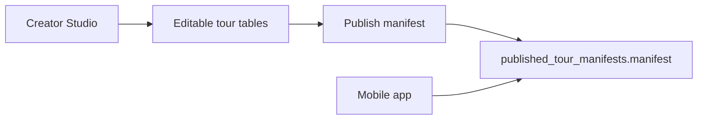

# Architecture

WanderKit is a pnpm monorepo with two apps and two shared packages.

## Workspaces

- `apps/studio`: Next.js App Router app for creators.
- `apps/mobile`: Expo Router app for visitors.
- `packages/shared`: TypeScript domain types and Zod schemas.
- `packages/supabase`: Supabase client helpers and manifest fetch functions.
- `supabase/migrations`: SQL migrations.

## Data Model

Creator drafts are editable records in Supabase. Publishing compiles a draft into a frozen `PublishedTourManifest` JSON object. The mobile app looks up a manifest by tour code and validates it with `PublishedTourManifestSchema`.

## Manifest Contract

The manifest is the mobile app contract. It contains:

- `schemaVersion`
- public tour metadata
- tour code
- route coordinates
- ordered stops
- audio URLs
- optional audio asset metadata
- publish metadata
- content hash

Draft-only fields, creator-only notes, and unpublished assets must not be required by mobile.

## Supabase

The initial schema stores:

- creator profiles
- tours
- tour stops
- tour routes
- `tour-audio` Storage bucket
- published manifests

Published manifests for published tours are readable by anonymous clients so the mobile app can fetch by tour code. Multiple immutable manifest versions can share the same tour code; mobile selects the highest `publish_version` for that code. Draft data should remain creator-owned.

## Mobile Lookup States

The mobile tour route loads the latest `published_tour_manifests` row by `tour_code`, validates the returned JSON with `PublishedTourManifestSchema`, checks that the JSON `contentHash` matches the stored `content_hash`, and renders distinct states for:

- loading
- missing Supabase configuration
- code not found
- invalid published manifest
- cached manifest fallback
- successful manifest load

Local seed data includes `OLDTOWN` for the success path and `BADJSON` for the invalid-manifest path.

After a successful lookup, mobile stores the validated manifest in AsyncStorage under the normalized tour code. If Supabase is not configured or a later network lookup fails, the app attempts to render that cached manifest and shows a cached notice. Not-found and invalid-manifest responses remain authoritative and do not fall back to cache.

The mobile entry screen summarizes offline cache state by listing saved manifest count and downloaded audio file count/size. Visitors can clear both manifest and audio caches from that screen.

## Stop Audio

Stop detail screens use the published manifest as their source of truth. The mobile app reloads the manifest by tour code, finds the selected stop by `stop.id`, and uses `stop.audioUrl` for playback through Expo Audio. This keeps audio playback tied to the immutable published manifest rather than draft editor data.

Before playback, the stop detail screen asks the audio cache for a local file URI. The cache stores downloads in the app document directory under a deterministic tour/stop/audio URL key. If a cached file exists, Expo Audio plays it. If not, the app downloads the file and then plays the local copy. Download failures fall back to streaming the remote `audioUrl`.

## Route Map

The mobile tour screen renders `manifest.route` as a map polyline and `manifest.stops` as numbered markers through `react-native-maps`. The map computes an initial region from all route and stop coordinates, then fits the viewport to the route when the native map is ready. Marker taps open the stop detail/audio screen.

## Creator Studio Drafting

Creator Studio edits a `StudioDraftTour` shape shared from `packages/shared`. Draft route points supply the editable polyline, while draft stops supply numbered pins, audio URLs, optional audio asset metadata, and copy. The Studio preview builds a `PublishedTourManifest` from that draft, validates it with Zod, and shows the frozen JSON contract before publish.

Audio publishing is URL-based for the MVP. `tour_stops.audio_asset_path` stores the playable hosted URL used by mobile, while optional metadata columns such as `audio_storage_path`, `audio_file_name`, `audio_mime_type`, `audio_credit`, and `audio_license` preserve asset references for Studio.

When a creator chooses an audio file, Studio reads browser metadata from the local file and fills the stop duration before upload. Studio then uploads through `POST /api/studio/audio`, a server-only multipart endpoint that uses the Supabase service-role key. Files are written to the public `tour-audio` Storage bucket under a creator/tour/stop path, then Studio copies the returned public URL into the stop's `audioUrl`. Mobile does not need Storage credentials because it only consumes the published manifest URL.

The Studio API routes use the Supabase service-role key on the server only:

- `GET /api/studio/drafts` lists saved draft summaries for the configured demo creator.
- `GET /api/studio/drafts/[tourId]` reconstructs a draft from tour, route, and stop rows.
- `GET /api/studio/drafts/[tourId]/publishes` lists immutable published manifest versions for the draft.
- `POST /api/studio/audio` uploads a stop audio file and returns its public Storage URL.
- `POST /api/studio/drafts` saves tour, route, and stop draft rows.
- `POST /api/studio/publish` validates the manifest, saves current draft rows, then calls the `publish_tour_manifest` RPC.

The `publish_tour_manifest` RPC locks the tour row, computes the next `publish_version`, computes the canonical manifest content hash in Postgres, writes that hash into both the manifest JSON and the `content_hash` column, marks the tour as published, and inserts the frozen manifest in one database transaction. This avoids a tour being marked published without a corresponding immutable manifest row.

Published manifest rows have database constraints that keep `tour_id`, `tour_code`, and `content_hash` aligned with the JSON payload. A trigger blocks updates and deletes after insert, except no-op updates for operational idempotence. Public RLS reads go through a security-definer helper that only exposes manifests whose parent tour is published.

When service-role env vars are missing, the read routes return an empty local-only state and the mutation routes return local-only success messages after validation so the editor remains usable during early development.

Draft tour codes are stored on `tours.draft_tour_code`. Published tour codes remain on immutable `published_tour_manifests.tour_code`.
